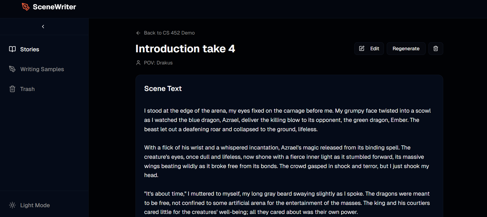

# SceneWriter

This is an AI assistant for creative fictional writing. The user provides the necessary context on their own, and the AI generates a scene for the user to edit. The intent is that this does not remove the responsibility of creativity from the author while still being useful.

## Background

I'm not an avid writer, or even necessarily a very good writer, but I enjoy reading, and for the past year I've spent some time writing a fictional story. This has turned into mostly worldbuilding, with all the details stored in a large text document. Organization has been difficult, as has consistency in writing to the worldbuilding document, and going back to the story after spending my time elsewhere has seemed daunting due to the growing overhead of getting myself up to speed each time.

## AI Integration

AI is the main benefit this program provides, in combination with providing a framework to write a story. This currently utilizes a model locally installed via Ollama, although I plan to expand it to use an API token for OpenAI to see if that provides better results.

## AI in Code Building

I also used v0 by Vercel to build the frontend. It was useful given this was not an incredibly large product, but after taking the code off I found there was a large amount of code duplication, which was a pain to deal with. I also used GitHub Copilot Pro, which was incredibly helpful and saved a lot of time that otherwise would have been spent typing or looking up information with which I was somewhat familiar.

## What I Learned

- I learned NextJS for this project (mostly because that was the output of v0, but also because I was familiar with React and was curious what it would look like). I found it was useful once I got into it, although it took some time to understand the difference between client and server modules. I think I would use it again.

- This was also my first time installing and using a local AI model. I learned that AI models require high-level hardware to run, meaning using a local model can severly limit you unless you have a pretty beefy machine. Smaller models such as gema3:270m were much faster than larger models like llama3.2, but the quality was much lower.

- I learned that code duplication makes development a lot slower and less consistent. I was able to mitigate this by a small amount, but I'm hoping to be able to go back and refactor it, that should reduce the size of the program pretty significantly.

## Deployment

In its current design, this tool is 100% local. The reasoning behind this is that I want the tool to be completely free for the user, and hosting a model on an EC2 instance would get expensive due to the hardware requirements of AI models. However, given that even the largest local models haven't given very satisfactory results and that I'm considering removing talking to an AI model locally, this could feasibly be deployed to a website.