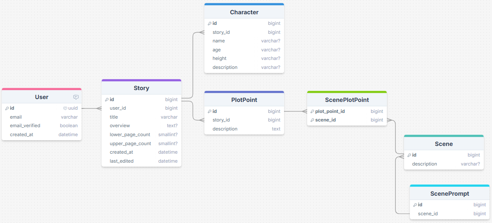

# SceneWriter Initial design
## Purpose

When I am in the process of writing a story, I end up with a large document containing all the background. As a result, not only is it hard for me to remember everything I want to include, but it's difficult for me to stay consistent with all the small details I've established (such as the height of the characters, the history of a town, or how I wanted each character to play their role in a portion of the plot). These troubles increase when I take a break from writing and attempt to pick it back up several months later.

SceneWriter utilizes AI to write individual scenes. The site provides a layout that walks the user through the process of providing sufficient context to the AI model, increasing consistency and quality of the output.

This is a human-first AI assistant. The responsibility and effort of creativity is not removed from the writer, but AI is able to quickly put their ideas into action. The writer is then able to make necessary edits, or easily change context and reprompt. The AI model will be able to remind the writer of what they have already established in their story design.

## Goals
- Have a usable product that fulfills its purpose
- Have a well-designed backend
- Have an intuitive and aesthetically pleasing frontend
- Have it hosted on the cloud at a reasonable cost
- Allow users to run the code locally, connected to a locally-installed LLM

## Initial ERD

[DrawSQL link](https://drawsql.app/teams/student-2625/diagrams/scenewriter)

## System Design
### Tech Stack
- Frontend: Vue and TS, generate with V0
- Backend: TS
- Service: Express
- Database: PostgreSQL
- User Management: AWS Cognito
- Web Hosting: Route53, CloudFront, S3
- Backend Hosting: AWS EC2 or AWS Lightsail
- DB Hosting: Supabase
- AI Model: llama3.2, gemma3

## Initial Schedule
[Timeline](timeline.md)